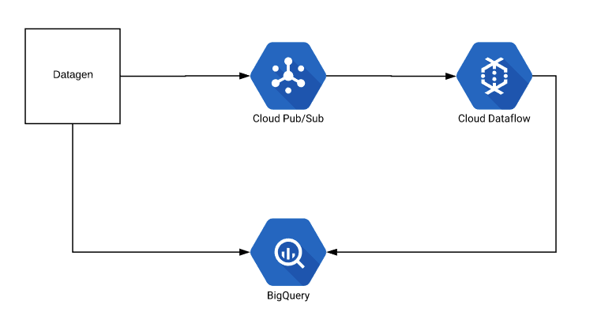

## Deduplication with Cloud PubSub and Cloud Dataflow on Google Cloud Platform

This is the source code that accompanies the solution: Deduplication of messages with Cloud PubSub and Cloud Dataflow. This sample code demonstrates three approaches for deduplication:

- PubSubIO: `com.google.examples.dfdedup.DedupWithPubSubIO`
- Distinct transform: `com.google.examples.dfdedup.DedupWithDistinct`
- Custom state based deduplication: `com.google.examples.dfdedup.DedupWithStateAndGC`

## End to end pipeline

You can run the following end to end pipeline to explore deduplication behavior across all three approaches:

### Setting up resources

***NOTE:***
If you're new to GCP, please see quickstarts for [Cloud PubSub](https://cloud.google.com/pubsub/docs/quickstarts), [BigQuery](https://cloud.google.com/bigquery/docs/quickstarts) and [Cloud Dataflow](https://cloud.google.com/dataflow/docs/quickstarts)

#### BigQuery
Use the schema files under `bqschemas/` to create

#### Cloud PubSub

### Running Python-based the data generator
Blah blah